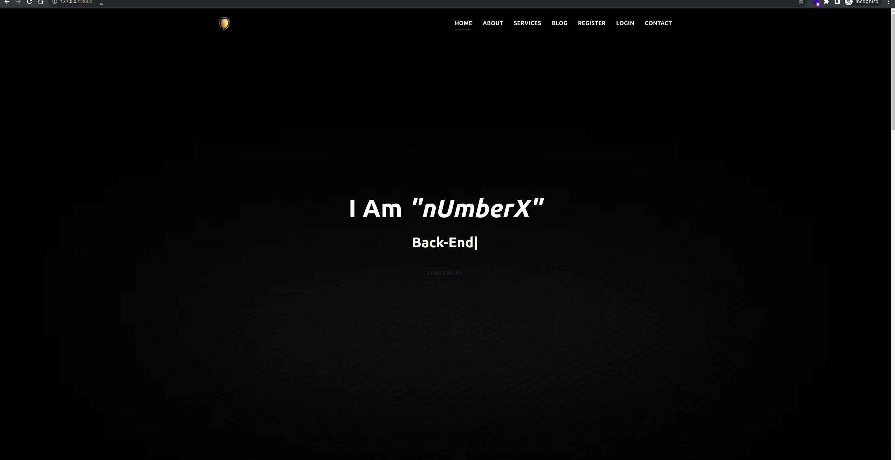

# Personal Website
An advanced personal website built with [Django Framework](https://www.djangoproject.com/).
#
# 

## Description
#### This project is an<i> Advanced Personal Website</i> built with the <b>[Django Framework](https://www.djangoproject.com/).</b> This project is not developed to be a complete website, but rather a demonstration of the capabilities of the framework. The website offers a variety of features such as Dynamic site setting including even SEO related features.  A simple CMS is also included to allow the user to manage their Information. A mailing system is also included in the project, However this is not fully implemented yet, but In my next project which is probably an encrypted chat application, I will implement a fully encrypted chat system. And the mailing system will be implemented with major features for authentication purposes, I have optimized the database queries as much as i could,Although this project is not built for deployment, Of course this project will get more features added to it over time.it is a good example of how a website can be built with the framework. Feel free to look at the source code for this project on github and use the code for your own projects.

## Getting Started
#### To get started, you will first of all need to have python installed on your computer. You can download python from [here](https://www.python.org/downloads/). You also need to have the python virtual environment installed. You can download the virtual environment from [here](https://virtualenv.pypa.io/en/latest/installation.html).  
### you will create the virtual environment by running the following command:
```bash
python3 -m venv venv # creates a virtual environment
```
### you will then need to activate the virtual environment by running the following command:
```bash
source venv/bin/activate # activates the virtual environment
```
### you will then need to install the requirements by running the following command:
```bash
pip install -r requirements.txt # installs the requirements
```
### In order for the project to work properly, you will need to create a file named `settings.py` in the root directory of the project. This file will contain the settings for the project. The settings will be stored in a dictionary and will be imported into the project's settings. :

### Some of the settings that you will need to set are:
#
- ```SECRET_KEY: Some Random String Here```
#
- ```EMAIL_HOST: Email provider's smtp server it would be   easier to just use gmail's smtp server 'smtp.gmail.com', However I suggest using outlook's smtp server 'smtp-mail.outlook.com'```
#
- ```EMAIL_HOST_USER: Email provider's username   e.g shekooha696@proton.me```
#
- ```EMAIL_HOST_PASSWORD: Email provider's password```
```json
{
  "secrets" : {
    "SECRET_KEY": "Some Random String Here",
    "EMAIL_HOST": "smtp.gmail.com",
    "EMAIL_PORT": 587,
    "EMAIL_HOST_USER": "username@domainname.com",
    "EMAIL_HOST_PASSWORD": "PASSWORD",
  }
}
```
<!-- Create db -->
### you will then need to create the database by running the following command:
```bash
python manage.py makemigrations
python manage.py migrate
```
### you will then need to run the following command and create a superuser:
```bash
    python manage.py createsuperuser
```
### Also in order for the static file to work you need to run the following command:
```bash
python manage.py collectstatic
```
### Then you will then need to run the server by running the following command:
```bash
python manage.py runserver
```
### If everything is working properly, you should see the something similar to the following message :
```bash
Watching for file changes with StatReloader
Performing system checks...

System check identified no issues (0 silenced).
August 19, 2022 - 07:40:13
Django version 4.1, using settings 'PersonalBlog.settings'
Starting development server at http://127.0.0.1:8000/
Quit the server with CONTROL-C.
```
### Now you have to complete some of site's settings in order for it to function by going to http://127.0.0.1:8000/admin/ and entering the superuser username and password. that you created earlier.
#
### Now you should be able to access the site by going to http://127.0.0.1:8000/
#

## If you have any questions, feel free to contact me
#

### Discord 
[](discordapp.com/users/366586864859348994) 
### Email address: shekooha696@proton.me

#
[](https://www.github.com/sirwilliamwallace)
#
[](https://www.python.org/downloads/)
[](https://www.djangoproject.com/downloads/)
[](https://www.w3schools.com/html/)
[](https://www.w3.org/Style/CSS/)
[](https://www.w3.org/International/questions/js/)


